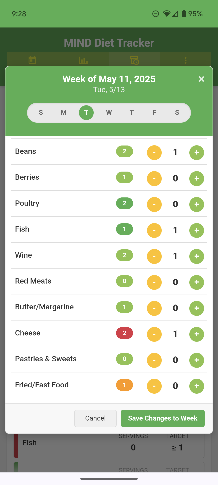
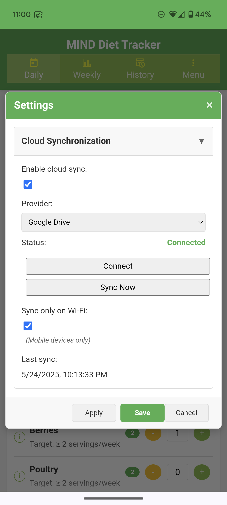
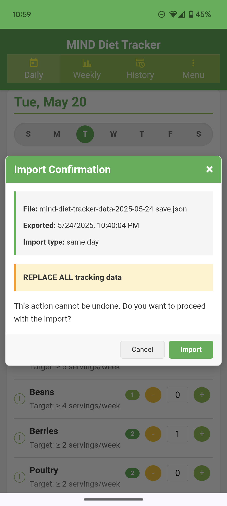

# MIND Diet Tracker PWA

A Progressive Web App (PWA) designed to help users track their daily and weekly adherence to the principles of the MIND Diet.  Record servings of key food groups each day, view weekly summaries, and browse your historical data. All data is stored locally on your device and can be optionally synchronized across multiple devices using cloud storage.

[**Live Demo**](https://mind-pwa-fawn.vercel.app/) | [**View Wiki for Complete Documentation**](../../wiki)

### ⚠️ Cloud Sync Limitations in Demo

The hosted demo app (on Vercel) **does not currently support cloud sync** via Google Drive or Dropbox for general users. This is due to testing restrictions imposed by the API providers.
* **Google Drive sync**: Only available to registered test users added to the app's OAuth client.
* **Dropbox sync**: Only available to the developer and any manually added testers.

If you'd like to test these features, open an issue or contact me with the email address associated with your Google or Dropbox account so I can add you as a test user.

## App Screenshots

  
<strong>Main Views & Menu</strong>

  <table>
    <tr valign="top">
      <td></td>
      <td></td>
      <td></td>
      <td></td>
    </tr>
  </table>

  
<strong>Modal Dialogs</strong>

  <table>
    <tr valign="top">
      <td></td>
      <td></td>
      <td></td>
      <td></td>
    </tr>
  </table>

## Quick Start

1. **Open the app** in any modern web browser or install it to your home screen as a PWA.
2. Use the **Daily** view to record servings for each food group for a given day.  Use the date navigation to select a different date, as needed.
3. Check the **Weekly** view to monitor your progress toward targets.
4. Browse past weeks in the **History** view, and use the *Edit* button to modify daily entries for a past week.
5. (Optional) Enable **Cloud Sync** in Settings to synchronize data across devices.

## Core Features

- Date-specific tracking of MIND Diet food groups with daily and weekly totals.
- Weekly summary by food group.
- Historical data archiving and review.
- Edit function to directly change the daily entries in historical weeks.
- Food information tooltips with serving size details.
- Color coding to highlight when targets met or limits exceeded.
- Cloud synchronization with Google Drive or Dropbox.
- Import/export data capabilities.
- PWA features (offline use, installable).
- Responsive design optimized for mobile and desktop use.

## Technology Stack

- HTML5, CSS3 (including CSS Variables)
- Modern JavaScript (ES6+ Modules, Async/Await)
- IndexedDB (for storing weekly history)
- localStorage (for storing current daily/weekly state)
- Service Workers (for PWA offline caching)
- Manifest.json (for PWA installability)
- Centralized logging (for troubleshooting)
- Material Design Icons
- Google Drive & Dropbox APIs (for cloud synchronization)
- Node.js (for Git hook version generation during development)

## Installation / Deployment (Self-Hosting)

1. **Prerequisites:**

   - A web server capable of serving static files
   - Node.js (if using Git hooks)
   - (Optional) Google Drive & Dropbox API keys for cloud sync functionality

2. **Get the Code:** Clone this repository or download the source code files

3. **Set Up:**

   - If cloning, copy `pre-commit.example` to `.git/hooks/pre-commit`
   - For cloud sync, create a `config.js` file with your API keys (use `scripts/generateConfig.js` as a template)

4. **Generate Version:** Run `npm run generate-version` to create version.json

5. **Deploy:** Place all files in a web-accessible directory on your server

6. **Access:** Use an HTTPS connection to enable PWA features and cloud APIs

For detailed installation instructions, see the [Installation Guide](../../wiki/Installation-Guide) in the wiki.

## Cloud Synchronization

This app supports optional cloud synchronization with two providers:

- **Google Drive**: Data is stored in the app's private space, not visible in your Drive file listing.
- **Dropbox**: Similar to Google Drive, data is stored in the app's folder.

To enable cloud sync:

1. Open the **Settings** from the app menu.
2. Check "Enable cloud sync".
3. Select your preferred provider.
4. Click "Connect" to authenticate.
5. Your data will now automatically sync between devices.

For detailed cloud sync documentation, see the [Cloud Sync Guide](../../wiki/Cloud-Sync-Guide) in the wiki.

## Data Privacy

- All data is stored locally on your device by default.
- If cloud sync is enabled, data is transferred to your personal Google Drive or Dropbox account.
- The app does not collect or transmit any data to third parties.
- Export functionality allows you to create backups of your data at any time.

## Development Acknowledgments

This project was developed with assistance from several AI tools following the [vibe coding approach](https://en.wikipedia.org/wiki/vibe_coding):

- **Initial Development**: Core application structure and functionality was created largely with assistance from Google's Gemini 2.5 Pro Preview.
- **Refactoring and Enhancement**: Major refactoring, code organization improvements, UI enhancements, and cloud synchronization features were developed with assistance from Anthropic's Claude Sonnet 3.7.
- **Workflow and Code Review**: OpenAI's ChatGPT (GPT-4o) provided assistance with development workflow optimization and code review.

AI assistance was used primarily for code generation, architecture suggestions, and debugging support. The underlying application concept, design decisions, and final implementation responsibility remained with the human developer.

## License

This project is licensed under the GNU General Public License v3.0.

The core principles of the GPLv3 ensure that users have the freedom to run, study, share, and modify the software. If you distribute modified versions of this software, you must also license your modifications under GPLv3 and provide the source code. This ensures the software remains free for all its users.

See the [LICENSE](LICENSE) file for the full license text.

