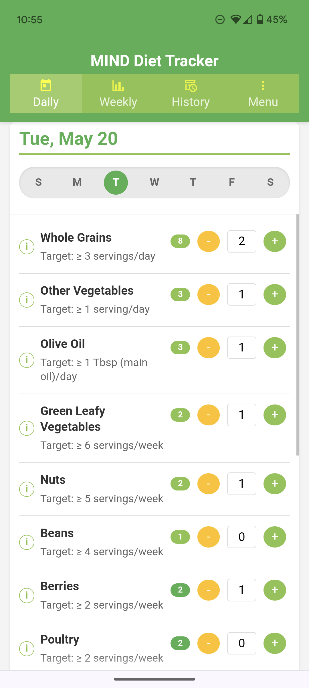
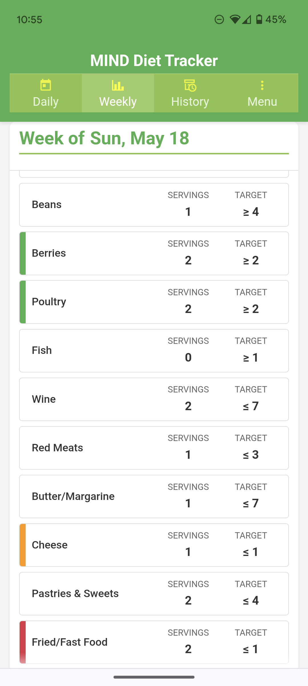

# MIND Diet Tracker PWA

A simple Progressive Web App (PWA) designed to help users track their daily and weekly adherence to the principles of the MIND Diet. Track servings of key food groups, view summaries, and browse your history, all stored locally on your device.

## What is the MIND Diet?

The MIND (Mediterranean-DASH Intervention for Neurodegenerative Delay) diet was developed by researchers at Rush University Medical Center, led by the late Dr. Martha Clare Morris. It combines elements of the Mediterranean and DASH (Dietary Approaches to Stop Hypertension) diets, focusing specifically on foods and nutrients that scientific research has shown may promote brain health and potentially reduce the risk of cognitive decline.

The MIND diet emphasizes consuming:
- 2+ servings of vegetables daily (including 1 serving of leafy greens)
- 3 servings of whole grains daily
- Beans/legumes 3 times weekly
- Nuts or nut butters 5 times weekly
- Berries (especially blueberries) 5 times weekly
- 2 tablespoons of extra virgin olive oil daily
- Fish at least once weekly
- Poultry twice weekly
- Moderate wine consumption (optional)

It also recommends limiting:
- Red meat (less than 4 servings weekly)
- Butter and margarine (less than 1 tablespoon daily)
- Cheese (less than 1 serving weekly)
- Pastries and sweets (limited servings)
- Fried and fast food (less than 1 serving weekly)

The diet has shown promising results in observational studies, with research suggesting that even moderate adherence to the MIND diet principles may be associated with reduced risk of Alzheimer's disease and slower cognitive decline. The MIND diet is currently being further evaluated in clinical trials.

For more information about the MIND diet and the research behind it, visit [Rush University's MIND Diet information page](https://www.rushu.rush.edu/news/rushs-mind-diet-again-ranked-among-best).

## App Screenshots

### Daily Tracker View

### Weekly Summary View

### History View

### Food Information Modal

### Edit Weekly Totals

## How to Use the MIND Diet Tracker

### Getting Started
1. **Open the app** in any modern web browser or install it to your home screen as a PWA
2. **Daily Tracking:** Use the "Daily Tracker" view to:
   - Record servings for each food group using the + and - buttons
   - View your daily counts and running weekly totals
   - Tap the ⓘ icon next to any food group for serving size information

### Monitoring Progress
1. **Weekly Summary:** Switch to the "Weekly" view to:
   - See your progress toward weekly targets
   - View color-coded status indicators (green for goals met, yellow for approaching limits, red for exceeding limits)
   - Edit weekly totals if needed using the "Edit Weekly Totals" button

### Viewing History
1. **History View:** Access the "History" view to:
   - Browse through previous weeks' data
   - Navigate using the date picker or prev/next buttons
   - Edit historical data if needed

### Additional Features
- **Menu** (☰): Access additional options:
  - **Export Data**: Save your tracking data as a JSON file
  - **Import Data**: Restore previously exported data
  - **About**: View app information and version details

### Understanding Color Coding
- **Green**: Target met or limit respected
- **Yellow**: Approaching but not yet meeting target (or approaching limit)
- **Red**: Target not met or limit exceeded

## Features

*   **Daily Tracking:** Input servings for food groups with daily or weekly targets.
*   **Weekly Summary:** View your progress towards weekly goals for the current week.
*   **History View:** Browse archived summaries of previous weeks.
*   **Food Group Information:** Clickable info icons (`ⓘ`) next to each food group name display detailed serving size information and examples in a pop-up dialog.
*   **Goal Visualization:** Easily see if weekly goals were met, missed, or approached limits using color-coded indicators in summary and history views.
*   **Automatic Resets:** Daily counters reset automatically at midnight (local time).
*   **Weekly Archiving:** Completed weeks (defaulting to a Sunday start) are automatically saved to local browser storage (IndexedDB).
*   **Data Management:**
    *   **Edit Weekly Totals:** Directly modify weekly serving totals for the *current* week or *any previously completed week* via a pop-up editor accessible from the "Current Week" and "History" views.
    *   **Export Data:** Export all current tracking data and history to a JSON file via the menu.
    *   **Import Data:** Import data from a previously exported JSON file (replaces existing data) via the menu.
*   **PWA Functionality:**
    *   Installable to your device's home screen (requires HTTPS connection).
    *   Offline access to cached application files via Service Worker.
*   **Responsive Design:** Styling adjustments for use on mobile and desktop devices.
*   **About Dialog:** Provides application details, version information (based on Git commit), and environment details via the menu.

## Technology Stack

*   HTML5
*   CSS3 (including CSS Variables)
*   Modern JavaScript (ES6+ Modules, Async/Await)
*   IndexedDB (for storing weekly history)
*   localStorage (for storing current daily/weekly state)
*   Service Workers (for PWA offline caching)
*   Manifest.json (for PWA installability)
*   Node.js (for Git hook version generation during development)

## Development Acknowledgments

This project was developed with assistance from several AI tools:

- **Initial Development**: Core application structure and functionality was created largely with assistance from Google's Gemini 2.5 Pro.
- **Refactoring and Enhancement**: Major refactoring, code organization improvements, and UI enhancements were done with assistance from Anthropic's Claude 3.7 Sonnet.
- **Workflow and Code Review**: OpenAI's ChatGPT (GPT-4o) provided assistance with development workflow optimization and code review.

AI assistance was used primarily for code generation, architecture suggestions, and debugging support. The underlying application concept, design decisions, and final implementation responsibility remained with the human developer.

## Installation / Deployment (Self-Hosting)

This application is designed to be hosted as a static website. You can run the version deployed on Vercel using the link above or follow the directions below.

1.  **Prerequisites:** You need a web server capable of serving static files (e.g., Apache, Nginx, Caddy, Synology Web Station, Netlify, Vercel, GitHub Pages) and Node.js if using the Git hook for versioning.
2.  **Get the Code:** Clone this repository or download the source code files. If cloning, you may need to set up the `pre-commit` hook manually (copy file `pre-commit.example` to `repodir/.git/hooks/pre-commit`).
3.  **(If using Git hook):** Run `npm run generate-version` (or `node update-version.js`) once initially if `version.json` doesn't exist.
4.  **Deploy Files:** Place all the files and folders (`index.html`, `app.js`, `db.js`, `style.css`, `sw.js`, `manifest.json`, `version.json`, `icons/` folder, etc.) into a web-accessible directory on your server.
5.  **Configure Server (if needed):** Ensure your web server is configured to correctly serve files with standard MIME types.
6.  **Access via HTTPS:** To use PWA installation features and Service Workers reliably, access the deployed application using an **HTTPS** connection.

## Future Enhancements (Potential Ideas)

*   **Settings:**
    *   Add ability to set starting day of week (currently defaulting to Sunday).
    *   Ability to customize food groups and target servings.
*   **Synchronization:** More automated sync options between devices/clients.
*   **UI/UX:**
    *   Haptic feedback on mobile interactions.
    *   Potentially more visual charts/graphs for history or progress.
    *   Refinements to layout and styling.

## License

This project is licensed under the GNU General Public License v3.0.

The core principles of the GPLv3 ensure that users have the freedom to run, study, share, and modify the software. If you distribute modified versions of this software, you must also license your modifications under GPLv3 and provide the source code. This ensures the software remains free for all its users.

See the [LICENSE](LICENSE) file for the full license text.

