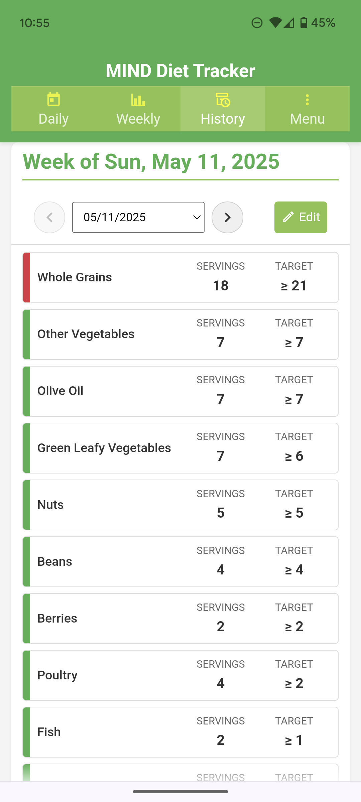

# MIND Diet Tracker PWA

A simple Progressive Web App (PWA) designed to help users track their daily and weekly adherence to the principles of the MIND Diet. Track servings of key food groups, view summaries, and browse your history, all stored locally on your device.

[**View Wiki for Complete Documentation**](../../wiki)

## App Screenshots

  
<strong>Main Views</strong>

  <table>
    <tr valign="top">
      <td></td>
      <td></td>
      <td></td>
    </tr>
  </table>
  
  
<strong>Modal Dialogs</strong>

  <table>
    <tr valign="top">
      <td></td>
      <td></td>
    </tr>
  </table>

## Quick Start

1. **Open the app** in any modern web browser or install it to your home screen as a PWA
2. Use the **Daily Tracker** to record servings for each food group
3. Check the **Weekly** view to monitor your progress toward targets
4. Browse past weeks in the **History** view

## Core Features

- Daily tracking of MIND Diet food groups
- Weekly summary with color-coded progress indicators
- Historical data archiving and review
- Food information tooltips with serving size details
- Edit functionality for weekly totals
- Export/import data capabilities
- PWA features (offline use, installable)

## Technology Stack

- HTML5, CSS3 (including CSS Variables)
- Modern JavaScript (ES6+ Modules, Async/Await)
- IndexedDB (for storing weekly history)
- localStorage (for storing current daily/weekly state)
- Service Workers (for PWA offline caching)
- Manifest.json (for PWA installability)
- Node.js (for Git hook version generation during development)

## Installation / Deployment (Self-Hosting)

1. **Prerequisites:** A web server capable of serving static files and Node.js (if using Git hooks)
2. **Get the Code:** Clone this repository or download the source code files
3. **Set Up:** If cloning, copy `pre-commit.example` to `.git/hooks/pre-commit`
4. **Generate Version:** Run `npm run generate-version` to create version.json
5. **Deploy:** Place all files in a web-accessible directory on your server
6. **Access:** Use an HTTPS connection to enable PWA features

## Development Acknowledgments

This project was developed with assistance from several AI tools:

- **Initial Development**: Core application structure and functionality was created largely with assistance from Google's Gemini 2.5 Pro.
- **Refactoring and Enhancement**: Major refactoring, code organization improvements, and UI enhancements were done with assistance from Anthropic's Claude 3.7 Sonnet.
- **Workflow and Code Review**: OpenAI's ChatGPT (GPT-4o) provided assistance with development workflow optimization and code review.

AI assistance was used primarily for code generation, architecture suggestions, and debugging support. The underlying application concept, design decisions, and final implementation responsibility remained with the human developer.

## License

This project is licensed under the GNU General Public License v3.0.

The core principles of the GPLv3 ensure that users have the freedom to run, study, share, and modify the software. If you distribute modified versions of this software, you must also license your modifications under GPLv3 and provide the source code. This ensures the software remains free for all its users.

See the [LICENSE](LICENSE) file for the full license text.

